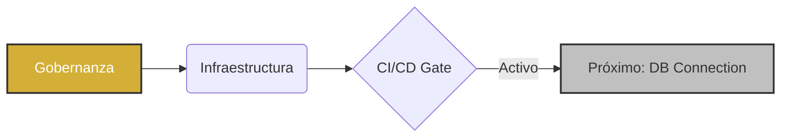

# 👑 Reporte Ejecutivo: Fase 01 - Cimentación Estratégica
## Proyecto: Bunuelos_TuRedondito | Etapa 1.1

---

### 🚀 Resumen del Progreso: "Cimientos de Acero"
Hemos completado con éxito la **Etapa 1.1: Infraestructura y Gobernanza**. El proyecto no solo tiene una estructura de archivos; tiene un **cerebro operativo** capaz de autorregularse y garantizar la calidad en cada línea de código.

| Indicador | Estado | Victoria Estratégica |
| :--- | :--- | :--- |
| **Gobernanza** | ✅ 100% | Protocolos SDD y Reglas Globales (C1.4) blindan el proyecto. |
| **CI/CD Quality Gate** | ✅ Activo | Ningún código entra a `main` sin pasar pruebas automáticas. |
| **Release Automation** | ✅ Activo | Versionamiento y Changlogs gestionados por Google Release Please. |
| **Trazabilidad** | ✅ Doble | Cada decisión técnica está mapeada en el Master Index. |

---

### 💎 Puntos de Poder (Victorias Clave)
1.  **Garantía de Estructura**: Se implementaron Smoke Tests que validan la integridad del sistema en cada cambio.
2.  **Seguridad Blindada**: Cero hardcoding. Gestión de secretos mediante `RELEASE_PLEASE_TOKEN` y variables de entorno.
3.  **Memoria Organizacional**: Se activó el log de lecciones aprendidas (LL_001 a LL_004).

### ⚠️ Verdades Críticas (Siguientes Pasos)
*   **F01-02 (Conexión a Base de Datos)**: Iniciamos el puente con Supabase. Necesitamos asegurar la conectividad con el `DBConnector`.
*   **Gestión de Datos**: Próxima implementación de DVC para el manejo de archivos pesados y versiones de datos.

---

### 📊 Estado de la Fase 01

> [!NOTE]
> **Conclusión Ejecutiva**: La plataforma está lista para recibir datos de producción. Hemos eliminado el riesgo de desorden técnico y asegurado un flujo de entrega profesional.

---
*Generado por Antigravity | 2026-03-13 21:30*
