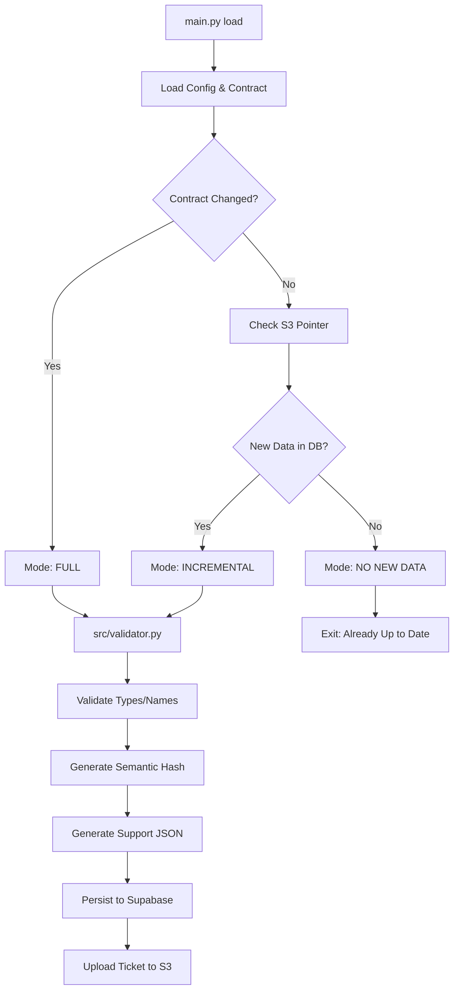

# [SPEC-F02-01] - Technical Specification: Validation & Ingest Certification (Stage 2.1)
**PROYECTO:** [Bunuelos_TuRedondito](./Project_Charter.md)  
**FASE:** Phase 2: MVP - Endogenous Variables  
**ESTATUS:** 🟢 FINALIZADO  
**VERSIÓN:** 1.1.0 (Refined by Tech Lead)

---

## 1. ARQUITECTURA LÓGICA [ARC-01]

El sistema opera bajo un modelo **Stateless & Cloud-First**. No se permite la persistencia de datos en archivos locales durante esta etapa.

### 1.1 Diagrama de Procesamiento

---

## 2. INGENIERÍA DE DATOS (Pipeline de Validación) [DAT-01]

### 2.1 Lógica de Modos de Ejecución [BR-21-03]
Para cada tabla habilitada en el contrato, se determina el modo de lectura:

1.  **FULL**:
    *   **Trigger**: No existe registro previo de la tabla O el hash del `data_contract.yaml` cambió significativamente.
    *   **Acción**: Lee el 100% de la tabla en Supabase.
2.  **INCREMENTAL**:
    *   **Trigger**: El último registro en `sys_validation_contract` tiene un puntero temporal/ID menor al `MAX(updated_at)` de la tabla origen.
    *   **Acción**: Lee solo los registros donde `updated_at > last_pointer`.
3.  **NO NEW DATA**:
    *   **Trigger**: Los timestamps de la base de datos coinciden con la última validación exitosa.

### 2.2 Huella Digital Semántica (Semantic Hash / Fingerprint) [BR-21-08]
Para asegurar la integridad sin archivos físicos, se genera un hash (SHA-256) basado en la concatenación de:
*   `Schema` (Configuración de columnas y tipos del contrato).
*   `row_count` (Cantidad total de registros validados).
*   **`Data Sample`** (Serialización JSON de las primeras 5 filas para detectar cambios en contenido real).

Este hash actúa como el "ADN" del dataset y se almacena en `sys_validation_contract.dvc_hash`, siendo el anclaje mandatorio para futuras descargas Parquet.

---

## 3. INTEGRACIONES Y ESQUEMAS [ARC-02]

### 3.1 Esquema Supabase: `sys_validation_contract`
| Columna | Tipo | Constraints |
| :--- | :--- | :--- |
| `id` | `uuid` | PK, Primary Key |
| `contract_yaml` | `text` | NOT NULL (Contenido del contrato) |
| `contract_hash` | `text` | Hash del archivo YAML para detectar deriva |
| `support_json` | `jsonb` | Estadísticos y Perfilamiento |
| `dvc_hash` | `text` | **Semantic Fingerprint** |
| `s3_pointer_uri` | `text` | URI del ticket de validación en S3 |
| `total_tables` | `int` | |
| `status` | `text` | `VALID` / `INVALID` |
| `created_at` | `timestamptz` | DEFAULT Now() |

### 3.2 Almacenamiento Cloud (Validation Bridge / Ingest Ticket) [REQ-21-03]
Ruta unificada del "Ticket de Autorización" en Supabase Storage / S3:
`pipeline_tickets/stage_load/{execution_id}/load_report.json`

---

## 4. MLOPS Y DESPLIEGUE [OBJ-04]

*   **Fail-Fast**: El componente `validator.py` debe levantar una excepción `ContractViolationError` que sea capturada por el orquestador para detener el pipeline antes de persistir cualquier éxito parcial.
*   **Logs**: Cada validación exitosa genera un registro en `sys_pipeline_execution` vinculado al `validation_id`.

---

## 5. MATRIZ DE DISEÑO VS REQUERIMIENTOS

| Componente SPEC | Vínculo PRD | Descripción Técnica |
| :--- | :--- | :--- |
| Sección 1.1 (Mermaid) | `[REQ-21-01]` | Orquestación del comando `load`. |
| Sección 2.1 | `[BR-21-03]` | Implementación de modos FULL/INCREMENTAL. |
| Sección 2.2 | `[BR-21-05]` | Lógica de cálculo del Semantic Hash. |
| Sección 3.1 | `[REQ-21-04]` | Persistencia de auditoría en Supabase. |
| Sección 3.2 | `[REQ-21-03]` | Puente de validación vía S3. |

---
**Elaborado por:** Antigravity (MODO C: EL TECH LEAD)  
**Trazabilidad:** `[ARC-01]`, `[ARC-02]`, `[DAT-01]`, `[OBJ-04]`
