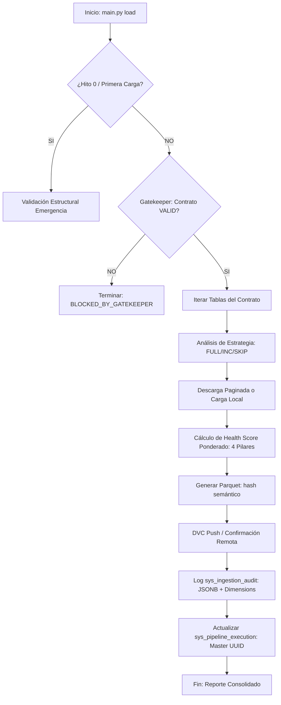

# [SPEC-F02-02] - SPEC: Arquitectura de Ingesta y Auditoría Bronce

**PROYECTO:** [Forecasting de Demanda de Buñuelos](../artifacts/Project_Charter.md)  
**FASE:** Phase 2: MVP - Endogenous Variables `[PH-02]`  
**ETAPA:** Ingesta Física y Almacenamiento Bronce `[ST-02-02]`  
**ESTATUS:** 🏗️ EN DISEÑO  
**VERSIÓN:** 1.0.0

---

## 1. ARQUITECTURA TÉCNICA Y DIAGRAMA LÓGICO `[ARC-22]`

El componente central es `src/ingestor.py`, un orquestador de bajo nivel diseñado para ser ejecutado de forma autónoma o vía `main.py load`.

### Diagrama de Flujo (Lógica de Ingesta):


---

## 2. ESPECIFICACIONES DE INGENIERÍA DE DATOS `[DAT-22]`

### 2.1 Lógica de Paginación (Supabase Bypass)
Para superar el límite de 1000 registros, el `ingestor.py` implementará un bucle `while` controlado por el rango de índices o fechas:
*   **Método:** `range(start, end)` utilizando los headers `Range` de la API de PostgREST.
*   **Seguridad:** Verificación de conteo total (`count='exact'`) previo a la descarga para asegurar integridad 1:1.

### 2.2 Almacenamiento Bronce (Parquet)
*   **Motor:** `pyarrow`.
*   **Compresión:** `snappy` (balance óptimo entre velocidad y tamaño).
*   **Hashing Semántico:** Se utilizará un hash SHA-256 del contenido crudo del DataFrame (ordenado por fecha) para garantizar que el nombre del archivo solo cambie si el dato cambia.

---

## 3. INTEGRACIONES Y ESQUEMAS API `[INT-22]`

### 3.1 Tabla de Auditoría: `sys_ingestion_audit`
Esta tabla en Supabase es el contrato de comunicación con el Dashboard en Node.js.

| Campo | Tipo | Descripción |
| :--- | :--- | :--- |
| `id` | UUID (PK) | Identificador único de ingesta. |
| `execution_id` | UUID | FK a `sys_pipeline_execution`. |
| `table_name` | String | Nombre de la tabla procesada. |
| `semantic_hash` | String | Hash único del archivo Parquet. |
| `status` | Enum | `SUCCESS`, `FAILED`, `NO_DATA`. |
| `health_score` | Float | Valor 0-100 calculado. |
| `row_count` | Integer | Número total de registros. |
| `health_report` | JSONB | Objeto detallado para el Dashboard. |

### 3.2 Estructura del `health_report` (JSONB):
```json
{
  "samples": {
    "head": [ ... ],
    "tail": [ ... ],
    "random": [ ... ]
  },
  "quality_metrics": {
    "null_columns": ["col_a", "col_b"],
    "duplicate_rows": 0,
    "sentinel_values_found": { "col_x": 15 },
    "custom_rules_violations": [ "sum_check_failed" ]
  },
  "time_analysis": {
    "frequency": "D",
    "gaps_detected": ["2026-01-15"],
    "has_leakage": false,
    "freshness_lag_days": 1
  },
  "health_dimensions": {
    "business": 100.0,
    "continuity": 95.0,
    "integrity": 100.0,
    "cleaning": 100.0
  }
}
```

### 3.3 Algoritmo de Health Scoring Ponderado `[RSK-22]`
El puntaje final se calcula mediante la agregación ponderada de 4 dimensiones:
1.  **Reglas de Negocio (50%)**: Penalización por cada registro que falla las `custom_rules` de `config.yaml`.
2.  **Continuidad Temporal (20%)**: Penalización por cada día de Gap detectado y lag de frescura > 7 días.
3.  **Integridad Técnica (20%)**: Penalización por porcentaje de nulos y fechas inválidas (NaT).
4.  **Higiene de Datos (10%)**: Penalización por filas duplicadas y detección de valores centinela.

### 3.3 Alineación con TypeScript (Frontend Next.js)
El objeto `health_report` se ajustará al siguiente esquema (Interface TS) para garantizar la seguridad de tipos en el Dashboard:

```typescript
interface IngestionHealth {
  samples: {
    head: any[];
    tail: any[];
    random: any[];
  };
  quality_metrics: {
    null_columns: string[];
    duplicate_rows: number;
    sentinel_values_found: Record<string, number>;
    custom_rules_violations: string[];
  };
  time_analysis: {
    frequency: 'D' | 'M' | 'Y';
    gaps_detected: string[];
    has_leakage: boolean;
    freshness_lag_days: number;
  };
}
```

---

## 4. MLOPS Y DESPLIEGUE `[OPS-22]`

### 4.1 Sincronización Remota (Zero Local Dependency)
1.  **DVC Add**: Registro del archivo `.parquet`.
2.  **DVC Push**: Subida inmediata al storage configurado (S3/Supabase Storage).
3.  **Confirmación**: El `ingestor.py` ejecutará un check de existencia en el storage remoto antes de actualizar el estatus a `SUCCESS` en Supabase.

### 4.2 Orquestación
La integración en `main.py` se realizará mediante un nuevo método `load_stage()` en el orquestador, invocando al `IngestorManager`.

---

## 5. MATRIZ DE TRAZABILIDAD (SPEC vs PRD)

| ID SPEC | ID REQ / BR | Descripción de Cobertura |
| :--- | :--- | :--- |
| **[ARC-22-01]** | `[REQ-22-01]` | Orquestación multi-tabla dinámica. |
| **[DAT-22-01]** | `[REQ-22-02]` | Implementación de paginación por batches. |
| **[INT-22-01]** | `[REQ-22-05, REQ-22-08]` | Auditoría persistente y amigable para Node.js. |
| **[OPS-22-01]** | `[REQ-22-11]` | Validación obligatoria de sincronización remota. |
| **[DAT-22-02]** | `[REQ-22-12, Indicadores]` | Lógica de Gaps, Leakage y Freshness. |

---
**Diseñado por:** Antigravity (Tech Lead)  
**Fecha:** 2026-03-14  
